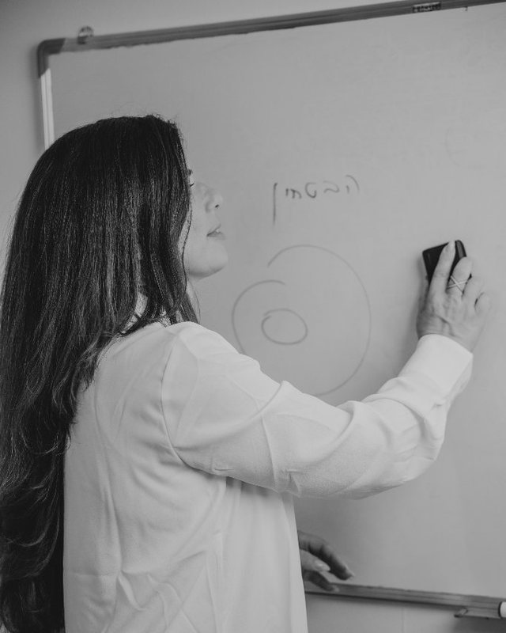

# CLAUDE.md — מפרט עיצוב מחדש מלא ל-CureMindset
## גרסה 2.0 — 1 בספטמבר 2026
## בנוי על Curable + Tony Robbins AI

---

## 0. כללי עבודה (חובה — קרא לפני הכל)

1. **אתה משפץ, לא בונה מאפס.** יש אתר חי ב-ketysegev.com עם backend פעיל. אתה משנה UI/UX ותוכן, לא מוחק מסד נתונים.
2. **RTL מלא.** כל הטקסטים בעברית. עיצוב right-to-left.
3. **Mobile-first.** 80% מהמשתמשים מטלפון. הכל עובד ונראה מעולה במובייל לפני הכל.
4. **Preview בלבד.** אל תשנה production בלי אישור.
5. **כל שינוי — דוח סיום:** מה השתנה, מה עובד, מה לא מוכן.
6. **הפרומפט הקליני כבר כתוב.** אל תכתוב אותו מחדש — הטמע אותו.
7. **לפני כל שינוי — קרא את הקוד הקיים.** אל תניח.

---

## 1. המודל: Curable + Tony Robbins AI

### 1.1 מה למדנו מ-Curable
Curable היא אפליקציית ריפוי דיגיטלית לכאב כרוני. העקרונות שלה:

**חווית משתמש (UX):**
- **Onboarding חם ואישי:** מסך פתיחה עם צבע אחד חזק (אצלם: teal, אצלנו: gold #C9A96E), כפתור אחד "Continue", הליכה דרך 5 מסכים פשוטים.
- **מסע מודרך (Guided Program):** המשתמש לא בוחר מתוך תפריט — הוא עובר דרך רצף מובנה: שיעור → תרגול → כתיבה → הרגעה. כל יום צעד אחד.
- **תוכן אישי (Personalized):** התרגילים מותאמים למה שהמשתמש שיתף. לא גנרי.
- **פשטות ויזואלית:** מסך אחד = פעולה אחת. לא עמוס. לא תפריטים מורכבים. נקי.
- **סיפורי הצלחה (Testimonials):** מובלטים בכל מקום — כי זה מה שמוכר.
- **14 ימים ניסיון חינם → תשלום.** מחיר ברור, לא מוסתר.
- **קהילה (Community):** תחושת "אני לא לבד" — חיוני לריפוי רגשי.

**תוכן (Content):**
- שיעורי מדע בשפה פשוטה (Pain Science Lessons → אצלנו: Brain Science / NLP)
- מדיטציות דינמיות (Dynamic Meditations → אצלנו: תרגולי עוגן / נשימות)
- טכניקות אימון מחדש של המוח (Brain Retraining → אצלנו: NLP / Future Pacing)
- תרגילי כתיבה (Writing Exercises → אצלנו: כתיבה תרפויטית)
- פודקאסט וסיפורי החלמה → אצלנו: סיפורי שינוי

### 1.2 מה למדנו מ-Tony Robbins AI
Tony Robbins AI הוא קואץ' דיגיטלי שמדמה את טוני רובינס ב-$39/חודש (ניסיון $1 ל-30 יום).

**עקרונות ה-AI:**
- **זה פרסונלי.** ה-AI זוכר את השם, המטרות, והשיחות הקודמות. כל תגובה מותאמת.
- **זה קול אמיתי.** Tony Robbins AI מדבר בקול של טוני — עם ElevenLabs. אצלנו: טקסט-לדיבור עם קול חמה, מקצועית.
- **זה לא שאלות/תשובות — זה אימון.** ה-AI לא נותן מידע, הוא מאמן. שואל שאלה אחת בכל פעם, מוביל לפעולה.
- **זה זמין 24/7.** אין צורך לקבוע תור. פותחים ומדברים.
- **זה מוביל לאקשן.** כל שיחה מסתיימת עם צעד אחד קונקרטי לעשות עכשיו.
- **זה מסתגל.** ככל שמשתמשים יותר, ה-AI מכיר טוב יותר את הדפוסים.
- **Onboarding כחוויה:** המשתמש עובר תהליך קצר שבו ה-AI מזהה את המטרה/אתגר שלו, ומשם כל החוויה מותאמת.
- **שפה אישית וישירה:** "I'm like having Tony in your pocket." אצלנו: "קטי בכיס שלך."

---

## 2. עיצוב חדש — פלטה ויזואלית

### 2.1 צבעים
```
Primary:     #C9A96E (gold) — עיקרי, CTA, כפתורים
Background:  #FAF8F4 (cream) — רקע ראשי
Surface:     #FFFFFF (white) — כרטיסים, פאנלים
Beige:       #E8E0D5 (beige) — רקע משני, הפרדות
Soft Blue:   #B8D4E3 (soft blue) — אלמנטים רגשיים, אייקונים
Text Dark:   #2D2A26 (ink) — טקסט ראשי
Text Medium: #6B6560 (ink-500) — טקסט משני
Text Light:  #9B958F (ink-300) — placeholders, hints
Success:     #16A34A (green) — הצלחה, אישור
Error:       #DC2626 (red) — שגיאה
```

### 2.2 טיפוגרפיה
- כותרות: font-heading (Heebo/AlefA), bold, גדולות
- גוף: font-body (Heebo), regular, 16px בסיס
- טקסט קטן: 13px
- שפה: עברית RTL

### 2.3 עיקרון עיצובי
**מסך אחד = פעולה אחת.** בכל רגע, המשתמש יודע מה לעשות עכשיו. אין תפריטים מורכבים. אין עומס. נקי, חם, מזמין.

---

## 3. מבנה האתר החדש

### 3.1 דפים ציבוריים (Public)

```
/                  → דף הבית (Landing Page)
/#about            → אודות קטי (בתוך דף הבית)
/#method           → השיטה (4 עמודים + מסע)
/#programs         → תוכניות ומחירים
/#testimonials     → סיפורי שינוי
/#organizations    → סדנאות לארגונים
/#cure-teens       → CURE Teens (פרימיום)
/workshops         → דף סדנאות נפרד
/register          → רישום (כניסה למערכת)
/login             → התחברות
```

### 3.2 אזור אישי (Member Area)

```
/app               → אזור אישי (נכנסים אחרי התחברות)
  ├── /chat        → שיחה עם קטי AI (המסך הראשי)
  ├── /journey     → המסע שלי (מודולים, התקדמות)
  ├── /tools       → ערכת כלים (תרגולים, אודיו)
  ├── /progress    → מעקב התקדמות (גרפים, ניתוח)
  ├── /plan        → התוכנית שלי (מנוי, תשלום)
  └── /profile     → פרופיל (פרטים, הגדרות)
```

### 3.3 פאנל ניהול (Admin)

```
/admin             → כניסה לפאנל
  ├── /dashboard   → דאשבורד כללי
  ├── /users        → ניהול משתמשים
  ├── /materials    → ניהול חומרים
  ├── /content      → ניהול תוכן (מאמרים, SEO)
  └── /settings     → הגדרות (תשלום, אימייל)
```

---

## 4. דף הבית החדש (Landing Page)

### 4.1 מבנה (מלמעלה למטה)

```
1. נאב (navbar) — שקוף, נעלם בגלילה, כפתור "להתחיל" תמיד גלוי
2. Hero — צבע gold מלא, כותרת אחת, כפתור אחד, תמונה של קטי
3. "מה עובר עלייך?" — 4 כרטיסי בעיה (חרדה, לחץ, ביטחון, דימוי)
4. "איך זה עובד" — 3 צעדים (שיחה → כלים → שינוי)
5. "השיטה" — 4 עמודי CureMindset (בהירות, חוסן, חשיבה, העצמה)
6. אודות קטי — תמונה + סיפור + הכשרות
7. סיפורי שינוי — 3 עדויות (כשיהיו)
8. תוכניות ומחירים — 3 מסלולים ברורים
9. CURE Teens — כרטיס פרימיום
10. ארגונים — פנייה ל-B2B
11. פוטר — קישורים, קונטקט, תנאים
```

### 4.2 Hero — מסך פתיחה

**עיצוב:** רקע cream (#FAF8F4), איור עדין או תמונת קטי, כותרת גדולה, כפתור gold.

```html
<section className="hero">
  <div className="hero-content">
    <p className="kicker">CureMindset · קטי שגב</p>
    <h1>הכוח לשנות נמצא כבר בתוכך.<br/>אני כאן לעזור לך למצוא אותו.</h1>
    <p className="subhead">
      אימון מנטלי דיגיטלי בשיטת NLP — שיחה, כלים ותרגול יומי
      שמובילים לחוסן רגשי אמיתי. לנוער, למבוגרים ולהורים.
    </p>
    <button className="cta-primary">להתחיל ניסיון חינם →</button>
    <p className="cta-note">3 ימים חינם · בלי כרטיס אשראי · מתחילים עכשיו</p>
  </div>
  <div className="hero-image">
    
  </div>
</section>
```

**לא:** כותרות ארוכות, 3 כפתורים, טקסט שיווקי. **כן:** כותרת אחת, כפתור אחד, פשוט.

### 4.3 "מה עובר עלייך?"

4 כרטיסים פשוטים, כל אחד עם אייקון ומשפט אחד:

```
🧠 "המחשבות לא מפסיקות" → חרדה
💪 "מרגיש/ה לא מספיק טוב/ה" → ביטחון
🌊 "הכל יותר מדי" → עומס רגשי
🧭 "לא יודע/ת לאן ללכת" → דימוי עצמי
```

כל כרטיס מוביל ל: "כן, זה בדיוק אני → התחל ניסיון"

### 4.4 "איך זה עובד"

3 צעדים ויזואליים (מספרים גדולים + אייקון + משפט):

```
1. מדברים — "מה עובר עלייך? כותבים בחופשיות. קטי הדיגיטלית מקשיבה ומבינה."
2. מקבלים כלים — "תרגול אחד קטן שאפשר לעשות עכשיו. לא תיאוריה — פעולה."
3. משתנים — "כל יום צעד קטן. ב-3 ימים כבר מרגישים את ההבדל."
```

### 4.5 תוכניות ומחירים (חדש — 3 מסלולים)

```
┌─────────────────┬──────────────────┬──────────────────┐
│     בסיסי       │     אמצע         │   Q-teams פרימיום │
│   ₪197/חודש     │   ₪297/חודש      │   ₪497/חודש       │
├─────────────────┼──────────────────┼──────────────────┤
│ ✅ צ'ט AI        │ ✅ כל מה בבסיסי   │ ✅ כל מה באמצע    │
│ ✅ מודולים 1-3   │ ✅ כל המודולים    │ ✅ סדנה חודשית    │
│ ✅ צ'ק-אין יומי  │ ✅ אודיו מודרך   │ ✅ קורסים מלאים   │
│ ✅ עוגן SOS     │ ✅ מעקב מתקדם    │ ✅ קהילה פרטית    │
│                 │ ✅ ניתוח דפוסים   │ ✅ מפגש זום חודשי │
├─────────────────┼──────────────────┼──────────────────┤
│ 3 ימים חינם →   │ 3 ימים חינם →    │ 3 ימים חינם →    │
│ "להתחיל"        │ "להתחיל" (מומלץ) │ "להתחיל"         │
└─────────────────┴──────────────────┴──────────────────┘
```

**כללי תשלום (חייבים להופיע לפני checkout):**
1. מחיר + מטבע (₪, ILS)
2. תדירות חיוב (חודשי)
3. תאריך חיוב ראשון (מיד בסיום ניסיון)
4. מה כלול בכל מסלול
5. תנאי ביטול (ביטול בכל עת, חיוב מפסיק ממחזור הבא)
6. "אין חיוב עד לאישור מפורש"

---

## 5. חווית משתמש חדשה — האזור האישי

### 5.1 עקרון מנחה: "Curable + Tony AI"

המשתמש נכנס וחווה **מסע מודרך**, לא תפריט. ה-AI של קטי הוא המרכז — כמו Tony Robbins AI שהוא הליבה של האפליקציה.

### 5.2 זרימת משתמש מלאה

```
[נרשמת] → [מסך פתיחה חם] → [שיחה ראשונה עם AI]
→ [AI מזהה אתגר] → [AI מציע כלי] → [תרגול]
→ [צ'ק-אין יומי] → [התקדמות] → [יום 4: סיום ניסיון]
→ [מסך סיכום + תשלום] → [מנוי מלא]
```

### 5.3 מסך פתיחה (Onboarding)

**עיצוב:** רקע gold (#C9A96E), טקסט לבן, כפתור אחד. כמו Curable.

```
┌─────────────────────────────┐
│                             │
│      CureMindset            │
│      ברוכה הבאה             │
│                             │
│   "אני קטי. אני כאן בשבילך. │
│    ספרי לי מה עובר עלייך."  │
│                             │
│   [מתחילים לדבר →]          │
│                             │
│   3 ימים חינם · בלי כרטיס   │
│                             │
└─────────────────────────────┘
```

### 5.4 שיחה עם קטי AI (המסך הראשי)

**זה הליבה.** כמו Tony Robbins AI — השיחה היא המוצר.

**UX:**
- מסך צ'אט נקי, full-screen במובייל.
- הודעת פתיחה מקטי: "היי, אני קטי. מה עובר עלייך היום?"
- המשתמש כותב חופשי — לא בוחר קטגוריה.
- קטי AI משקף, מאמת, שואל שאלה אחת פתוחה.
- כל 2-3 הודעות: קטי מציעה כלי אחד מעשי.
- כפתור "תרגלו איתי" מוביל לתרגול מודרך.

**כללי AI (מתוך הפרומפט הקליני — אל תשנה):**
- שפה חמה, אנושית, מקצועית.
- מפיק דפוס מתוך התוכן — לא חוזר כמו תוכי.
- שאלה פתוחה אחת בכל פעם.
- ממפה לאחד מ-4 עמודי CureMindset ולפרוטוקול הרלוונטי.
- מציע כלי מעשי אחד בכל צ'ק-אין.
- בטיחות: אם סימני פגיעה עצמית — עצירה והפניה לעזרה.

**תכונות הצ'אט:**
- היסטוריית שיחות נשמרת ונגללת.
- כפתור "האזנה" (text-to-speech) על כל תגובה של קטי.
- כפתור "תרגול" מופיע כשקטי מציעה כלי.
- מצב כתיבה מהיר — מקלדת נפתחת אוטומטית.
- אנימציית "קטי מקלידה..." בזמן תגובה.

### 5.5 המסע שלי (Journey)

**כמו Curable — רצף מודרך, לא תפריט.**

```
יום 1: להבין את האזעקה (שיעור + כתיבה + נשימות)
יום 2: העוגן שלי (שיעור + כתיבה + עיגון סומטי)
יום 3: הקול הפנימי המיטיב (שיעור + כתיבה + הנחיה)
─── סוף ניסיון — תשלום ───
יום 4+: עוגן הבית (שיעור + תרגול)
יום 5+: שינוי רמת זהות (שיעור + תרגול)
יום 6+: Future Pacing (שיעור + תרגול)
יום 7+: ויסות רגשי במשבר (שיעור + תרגול)
... (מודולים נוספים — נוסיף עם הזמן)
```

כל מודול = 3 חלקים (כמו Curable):
1. **ללמוד** — טקסט קצר + אודיו (3-5 דקות)
2. **לכתוב** — תרגיל כתיבה מודרך (5 דקות)
3. **להירגע** — תרגול מעשי (נשימות / עוגן / הנחיה)

### 5.6 ערכת כלים (Tools)

לא חלק מהמסע — זמינים תמיד, כפתור "SOS" נגיש:

```
🫧 נשימת קופסה (4-4-4-4, 3 פעמים) — אנימציה מודרכת
💛 עוגן SOS (יד על לב + "אני כאן, אני בטוח/ה")
📝 יומן רגעי אוויר — כתיבה חופשית
🎯 מיקרו-צעד — פעולה אחת קטנה שאפשר לעשות עכשיו
🏠 עוגן הבית — תרגול מונחה באודיו
🔮 Future Pacing — דמיון מודרך לתסריט עתידי
```

### 5.7 מעקב התקדמות (Progress)

**כמו Curable — ויזואלי, מעודד, לא מלחיץ.**

```
┌─────────────────────────────┐
│  יום 3 במסע · 3 ימים חינם   │
│  ████████░░░ 67% מהניסיון  │
├─────────────────────────────┤
│  ✅ 3 צ'ק-אינים             │
│  ✅ 2 מודולים הושלמו         │
│  ✅ 5 תרגולים               │
│  📈 ציון חוסן: 4.2 → 5.8    │
├─────────────────────────────┤
│  דפוסים שזיהיתי אצלך:       │
│  • חרדה מופיעה בבקרים       │
│  • הקול המבקר חזק אחרי      │
│    שיחות עם אמא            │
│  • עוגן הנשימה עובד תוך     │
│    פחות מדקה                │
└─────────────────────────────┘
```

### 5.8 מסך סיום ניסיון + תשלום

**כמו Curable — סיכום המסע + הצעה חמה.**

```
┌─────────────────────────────┐
│                             │
│   🌿 [שם], המסע רק התחיל   │
│                             │
│   ב-3 הימים האחרונים:       │
│   ✅ 3 צ'ק-אינים            │
│   ✅ 2 מודולים               │
│   ✅ 5 תרגולים               │
│   📈 חוסן: 4.2 → 5.8        │
│                             │
│   "הכלים שקיבלת הם שלך      │
│    לתמיד. אבל המסע המלא     │
│    כולל 12 מודולים נוספים,  │
│    אודיו, ואותי — איתך      │
│    בכל יום."                │
│                             │
│   ┌──────────────────────┐  │
│   │ להמשיך את המסע →     │  │
│   │ ₪297/חודש           │  │
│   │ ביטול בכל עת         │  │
│   └──────────────────────┘  │
│                             │
│   כבר יש קוד גישה? [הפעל]  │
│                             │
└─────────────────────────────┘
```

**תיקון קריטי:** הטקסט אומר "3 הימים הראשונים" — לא "14 הימים". הניסיון הוא 72 שעות.

---

## 6. פאנל ניהול (Admin) — מה שקטי צריכה

### 6.1 דאשבורד
```
┌────────────────────────────────────┐
│ משתמשות פעילות: 12  | בניסיון: 5 │
│ מנויות: 4           | ביטלו: 3    │
│ הכנסה חודשית: ₪1,188              │
├────────────────────────────────────┤
│ נרשמות חדשות (7 ימים):            │
│ • דנה, 22 — יום 2 בניסיון         │
│ • רוני, 16 — יום 1 בניסיון        │
│ • מיה, 14 — יום 3 (מחר פג ניסיון) │
├────────────────────────────────────┤
│ התראות:                            │
│ ⚠ 2 משתמשות לא נכנסו 5+ ימים      │
│ ⚠ 1 ניסיון פג ולא שולם            │
└────────────────────────────────────┘
```

### 6.2 פרופיל משתמשת
- פרטים + סטטוס + ציון חוסן
- היסטוריית שיחות (כל צ'ק-אין עם תאריך ותוכן)
- חומרים שהוקצו
- גרף התקדמות
- ניתוח AI: "אילו כלים נוספים כדאי לתת?"
- יצירת קוד גישה אישי

### 6.3 ניהול חומרים
- העלאת אודיו/תרגול/מאמר
- הקצאה למשתמשת ספציפית או לכולן
- עריכה ומחיקה

### 6.4 ניהול תוכן (חדש)
- כתיבת מאמרי SEO
- דפי ערים גיאוגרפיים (10 ערים)
- דפי נושאים קליניים (15 נושאים)

---

## 7. תוכן שחייב להיות באתר (וכרגע חסר)

### 7.1 מאמרי SEO (15 נושאים)
```
1. NLP לחרדה — איך זה עובד ולמה זה יעיל
2. שינוי רמת זהות — כשרוצים להשתנות באמת
3. חוסן רגשי לנוער — המדריך המלא
4. עוגן הבית — מציאת יציבות פנימית
5. Future Pacing — איך לדמיין את העתיד נכון
6. דימוי עצמי אצל מתבגרים — בנייה וחיזוק
7. חרדה חברתית אצל נוער — כלים מעשיים
8. ויסות רגשי בזמן משבר — מה עושים עכשיו
9. התמודדות עם לחץ לימודי — NLP לתלמידים
10. טראומה ונוירופלסטיות — המוח יכול להשתנות
11. הקול המבקר הפנימי — איך משתיקים אותו
12. דחיינות אצל נוער — השורש הרגשי
13. OCD והרגלים כפייתיים — עבודה עם תת-מודע
14. העצמה אישית — מאמונות מגבילות לפעולה
15. בריאות נפשית בעידן המלחמה — כלים להורים ונוער
```

### 7.2 דפי ערים גיאוגרפיים (10 ערים)
```
חיפה, קריית אתא, קריית ביאליק, קריית ים, נשר,
טירת כרמל, עכו, נהריה, ערד, באר שבע
```

כל דף: "אימון מנטלי ב[עיר] — קטי שגב" + תוכן מקומי.

### 7.3 מודולים נוספים (מעבר ל-3 החינמיים)
```
מודול 4: עוגן הבית — מציאת יציבות פנימית
מודול 5: שינוי רמת זהות — 9 שלבים
מודול 6: Future Pacing — עיגון העתיד
מודול 7: ויסות רגשי במשבר
מודול 8: הקול המבקר והקול המיטיב
מודול 9: דימוי עצמי וביטחון
מודול 10: התמודדות עם חרדה חברתית
מודול 11: פירוק דחיינות
מודול 12: העצמה ומוטיבציה
```

### 7.4 סיפורי שינוי (Testimonials)
כשיהיו עדויות אמיתיות — להוסיף. עד אז, להשתמש ב:
- סיפור המסע האישי של קטי (מהחסמים שלה לשיטה)
- תוצאות כלליות ("+500 תהליכים אישיים")

---

## 8. תיקונים דחופים (לעשות מיד)

### 8.1 סתירת "14 ימים" → "3 ימים"
```diff
- "14 הימים הראשונים היו רק הפתיחה"
+ "3 הימים הראשונים היו רק הפתיחה"
```

### 8.2 חשיפת מפתח — כבר תוקן מקומית
- `memberArea.js` — הורד OPENAI_API_KEY/Render מטקסט שגיאה
- `adminApp.js` — הורד Render מטקסט
- `server/openai.js` — הורד OPENAI_API_KEY מהודעת שגיאה

### 8.3 דליפת טקסט AI
בצ'ק-אין יש דליפת טקסט פנימי:
```
"לכן דף הנחיתה כתוב אליהם, בעוד תוכן הפרקים כתוב אל בני הנוער"
```
זה טקסט מערכת שדולף לתגובה. יש לנקות את הפרומפט או לסנן.

### 8.4 אכלוס תוכן ראשוני
- `GET /api/articles` → ריק. יש להכניס 3-5 מאמרים ראשונים.
- `GET /api/materials` → ריק. יש להכניס 3-5 חומרים ראשונים.

---

## 9. סדר עבודה ל-Claude Code

### שלב 1 — תיקונים דחופים (יום 1)
1. תקן "14 ימים" → "3 ימים" בכל מקום.
2. נקה דליפת טקסט AI בצ'ק-אין.
3. הורד כל חשיפת מפתח מהודעות שגיאה.
4. הכנס 3 מאמרי SEO ראשונים.
5. הכנס 3 חומרים ראשונים לספרייה.

### שלב 2 — דף הבית החדש (יומים 2-3)
6. בנה Hero חדש: כותרת + כפתור + תמונה.
7. בנה "מה עובר עלייך?" — 4 כרטיסים.
8. בנה "איך זה עובד" — 3 צעדים.
9. עדכן תוכניות ומחירים — 3 מסלולים (197/297/497).
10. עדכן מסך סיום ניסיון — סיכום + תשלום.

### שלב 3 — אזור אישי חדש (יומים 4-7)
11. בנה מסך פתיחה (onboarding) חם.
12. בנה צ'אט AI כמסך ראשי (full-screen chat).
13. בנה "המסע שלי" — רצף מודרך (Curable-style).
14. בנה "ערכת כלים" — SOS + תרגולים זמינים.
15. בנה "מעקב התקדמות" — גרף + דפוסים.
16. בנה "ברוכה השבה" לחוזרת.

### שלב 4 — תוכן SEO (יומים 8-10)
17. כתוב 5 מאמרי SEO ראשונים.
18. בנה 5 דפי ערים גיאוגרפיים.
19. הוסף מודולים 4-6 למסע המודרך.

### שלב 5 — פאנל Admin (יומים 11-14)
20. דאשבורד כללי + סטטיסטיקות.
21. רשימת משתמשים + פרופיל מלא.
22. ניהול חומרים (CRUD).
23. ניהול תוכן (מאמרים + SEO).

### שלב 6 — בדיקות (יומים 15-16)
24. משתמשת חדשה: רישום → ניסיון → שיחה → תרגול → תשלום.
25. משתמשת חוזרת: כניסה → "ברוכה השבה" → המשך.
26. אדמין: העלאת חומר → הקצאה → צפייה בפרופיל.
27. נגישות: RTL, mobile, keyboard, screen reader.

---

## 10. קישורים

- דומיין: https://ketysegev.com
- ריפו: https://github.com/ketylive8-arch/CUREMINDSETheraphy
- אירוח Frontend: Vercel
- אירוח Backend: Render (curemindsetheraphy)
- תשלום: Grow (pay.grow.link)
- פרומפט קליני: "פרומפט מערכת — CureMindset AI גרסה 3.0" (בדרייב)
- יומן: https://calendly.com/ketysegev
- וואטסאפ: 054-303-2349
- אימייל: ketyse@gmail.com
- ח.פ: 037662392

---

## 11. השראה ישירה

### מ-Curable:
- מסך onboarding חם עם צבע אחד + כפתור אחד
- רצף מודרך (לא תפריט): שיעור → כתיבה → הרגעה
- סיפורי הצלחה מובלטים
- 14 ימים ניסיון → מחיר ברור (אצלנו: 3 ימים)
- "Healing is possible. We'll show you how."

### מ-Tony Robbins AI:
- ה-AI הוא המוצר — לא פיצ'ר נספח
- זה פרסונלי — זוכר שם, מטרות, שיחות קודמות
- זה אימון, לא מידע — שאלה אחת → פעולה אחת
- זה זמין 24/7 — פותחים ומדברים
- "Tony's voice, energy, and real strategy" — אצלנו: קול וגישה של קטי
- Onboarding: ה-AI מזהה את האתגר → כל החוויה מותאמת
- $1 ל-30 יום ניסיון → $39/חודש (אצלנו: 3 ימים חינם → ₪297/חודש)

---

## 12. סיכום מהותי

האתר הנוכחי סובל משתי בעיות עיקריות:
1. **אין מה לראות** — האזור האישי ריק (אין חומרים, אין מאמרים, 3 מודולים בלבד).
2. **העיצוב לא מזמין** — לא כמו Curable שמרגיש כמו מסע ריפוי, אלא כמו טופס.

הפתרון: לבנות מחדש את חווית המשתמש בסגנון Curable (מסע מודרך, נקי, חם) עם AI במרכז בסגנון Tony Robbins (פרסונלי, זמין 24/7, מוביל לאקשן). ולמלא תוכן — מאמרי SEO, מודולים נוספים, חומרים.
